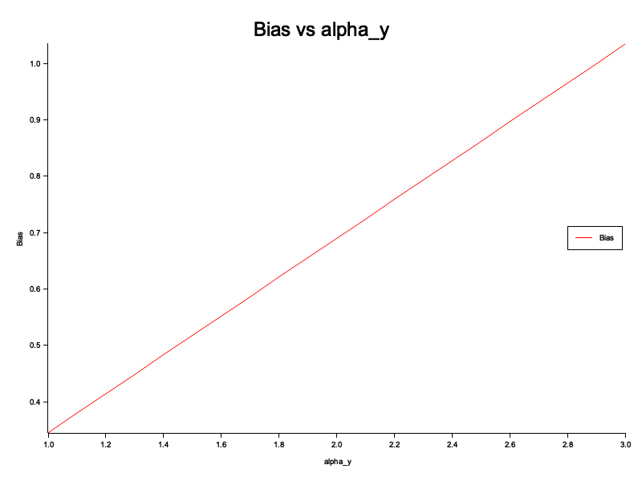

# Introduction

[](https://github.com/jmodeler/marketing-iv-methods-examination)
[](https://github.com/jModeler/marketing-iv-methods-examination/actions?query=branch%3Amaster)

This repository is my attempt to replicate the work in [Rossi (2014)](https://www.jstor.org/stable/24544798), using the [Rust programming language](https://www.rust-lang.org/).

A Rust package for exploring bias in instrumental variable (IV) regression models using simulated data.

This project is designed for educational and experimental purposes, demonstrating the effects of endogeneity in linear regression models.

---

## 📦 Project Structure

This repository is a hybrid Rust package that includes both a **library** and a **binary** executable.

├── src
│ ├── lib.rs # Library entry point
│ ├── main.rs # Binary entry point (CLI)
│ ├── utils/ # Reusable utilities (e.g., plotting, regression helpers)
│ └── simple_example/ # Example regression models and data generation
├── tests/ # Integration and doctests
├── Cargo.toml # Project metadata and dependencies
└── README.md # You're here


---

## 🚀 Getting Started

### Prerequisites

- Rust (version 1.65+ recommended)
- Cargo (comes with Rust)

Install Rust if needed:

```bash
curl --proto '=https' --tlsv1.2 -sSf https://sh.rustup.rs | sh
```

### Build the project
```bash
cargo build
```

### Run the binary
```bash
cargo run -- <command>
```
---

## 🔧 Available Commands

The binary supports multiple commands to run different regression analyses and simulations:

| Command             | Description                                                                     |
| ------------------- | ------------------------------------------------------------------------------- |
| `bias`              | Runs the omitted variable regression and reports the bias in the `x` coefficient.        |
| `bias-size`         | Varies the coefficient of the omitted variable (`alpha_y`) and plots bias vs this coefficient.   |
| `main-regression`   | Runs the full model regression (`y ~ x + v`) and prints estimated coefficients. |
| `biased-regression` | Runs a naive regression (`y ~ x`) and prints estimated coefficients.            |

### Example

```bash
cargo run -- bias
```

Output:

```bash
Bias in x coefficient: 1.5517241379310345
```

```bash
cargo run -- main-regression
```

Output:

```bash
Main regression (y ~ x + v) coefficients:
[-0.4844441508659102, 4.466301324996668], shape=[2], strides=[1], layout=CFcf (0xf), const ndim=1
```

Currently, the outputs are generated based on fixed values in the `main()` function. I will change that to user provided values in the future.
---

## 📚 Library Usage

This crate also exposes its functionality as a library. To use it from other Rust projects:

```toml
# In your Cargo.toml
marketing_iv_methods = { git = "https://github.com/jmodeler/marketing_iv_methods" }
```

Then in your Rust code:

```rust
use marketing_iv_methods::simple_example::run_regressions::run_yxv_regression;
```

The library includes:

* Data generators (`ind_var_generate`, `dep_var_generate`)
* Regression runners (`run_yxv_regression`, `run_other_regressions`)
* Plotting helpers (`plot_bias_vs_alpha_y`)
* Utility functions for generating random vectors

---

## 🧪 Testing

Unit tests and integration tests are included.

```bash
cargo test
```

To run documentation tests (doctests):

```bash
cargo test --doc
```

> 📌 Note: Make sure all doc examples include the necessary imports and context to avoid doctest failures.

---

## 📈 Plotting

Bias plots generated by `bias-size` are saved as PNG files using the `plotters` crate.

Output example: `bias_vs_alpha_y.png`



Make sure you have an environment that supports graphical output if running this on a remote or headless machine.

---

## ✍️ Contributing

Pull requests are welcome. For major changes, please open an issue first to discuss what you'd like to change.

---

## 📄 License

MIT License. See [`LICENSE`](LICENSE) for details.


# References
P. Rossi. (2014). Even the Rich Can Make Themselves Poor: a critical examination of the use of IV methods in marketing. Marketing Science, Vol. 33, No. 5, 655-672